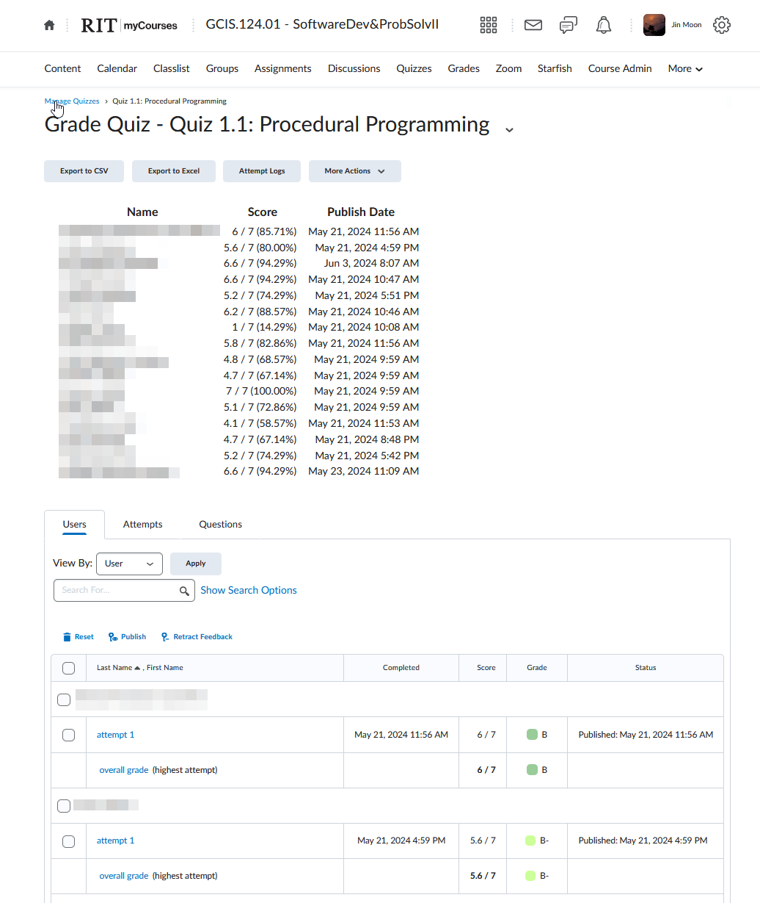

# Tampermonkey Scripts
Tampermoney scripts surrounding RIT's myCourses (D2L) Views
- [Chrome Extension](https://chromewebstore.google.com/detail/tampermonkey/dhdgffkkebhmkfjojejmpbldmpobfkfo)
- [Firefox Extension](https://addons.mozilla.org/en-US/firefox/addon/tampermonkey/)

Import these scripts to Tampermonkey

# Scripts
### myCourses Simplified Quiz View for CAs-2024-07-12.user
Parses and displays students who have taken a quiz in a condensed list.
